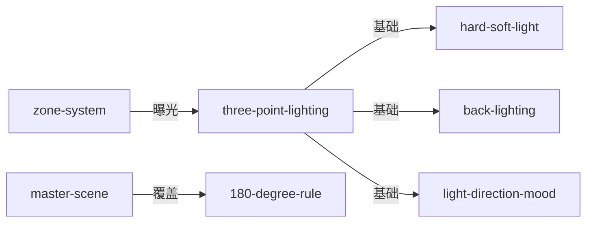

# 《电影摄影：理论与实践》Cinematography: Theory and Practice — Skill Index

> 本书由 book2skill 蒸馏, 共产出 **7** 个 skills。
> 处理时间: 2026-06-07

## 关于这本书

- **作者**: Blain Brown
- **出版年**: 2011 (第2版)
- **一句话主旨**: 电影摄影的完整方法论——从灯光理论到实践操作的系统化知识体系
- **整书理解**: 见 [BOOK_OVERVIEW.md](./BOOK_OVERVIEW.md)

---

## Skill 列表 (按主题分组)

### 灯光系统

- [`cinematography-three-point-lighting`](./cinematography-three-point-lighting/SKILL.md) — 三点灯光系统，电影照明的基础方法
- [`cinematography-hard-soft-light`](./cinematography-hard-soft-light/SKILL.md) — 硬光与柔光的选择与应用
- [`cinematography-back-lighting`](./cinematography-back-lighting/SKILL.md) — 逆光/背光的戏剧效果
- [`cinematography-light-direction-mood`](./cinematography-light-direction-mood/SKILL.md) — 灯光方向与情绪的关系

### 空间与构图

- [`cinematography-180-degree-rule`](./cinematography-180-degree-rule/SKILL.md) — 180度规则的摄影机操作
- [`cinematography-master-scene`](./cinematography-master-scene/SKILL.md) — 主场景拍摄法，覆盖镜头策略

### 曝光控制

- [`cinematography-zone-system`](./cinematography-zone-system/SKILL.md) — 区域系统曝光法，精确控制画面亮度

---

## 引用图



---

## 推荐学习顺序

1. **cinematography-three-point-lighting** — 最基础的灯光系统
2. **cinematography-hard-soft-light** — 硬光/柔光的选择
3. **cinematography-back-lighting** — 逆光的戏剧效果
4. **cinematography-light-direction-mood** — 灯光方向与情绪
5. **cinematography-zone-system** — 曝光控制
6. **cinematography-180-degree-rule** — 空间连续性
7. **cinematography-master-scene** — 覆盖镜头策略

---

## 接入 darwin-skill

所有 skill 均带有 `test-prompts.json` (darwin-skill 兼容格式), 可直接接入自动进化:

```
darwin evolve books/cinematography-brown/
```

---

## 审计轨迹

- 候选单元池: [candidates/](./candidates/)
- 被淘汰的候选 (含原因): [rejected/](./rejected/)
- BOOK_OVERVIEW: [BOOK_OVERVIEW.md](./BOOK_OVERVIEW.md)
