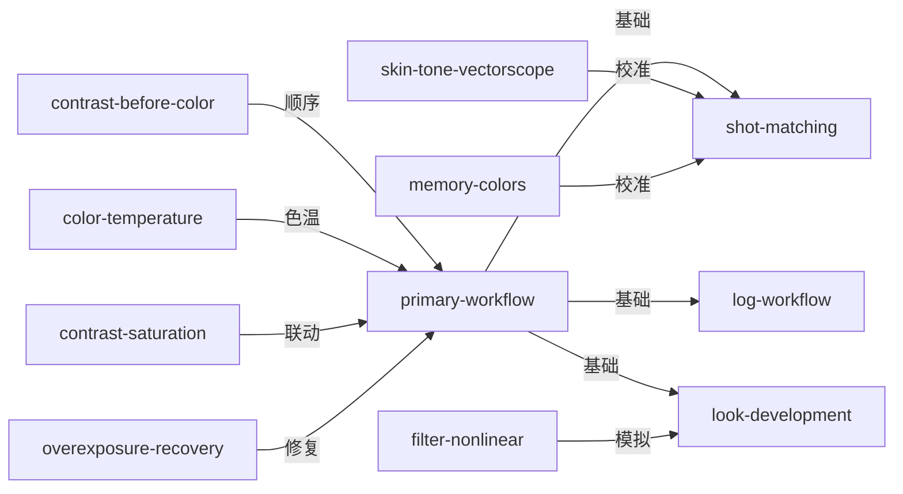

# 《调色师手册》Color Correction Handbook — Skill Index

> 本书由 book2skill 蒸馏, 共产出 **11** 个 skills。
> 处理时间: 2026-06-07
> 通过率: 44 候选 → 17 通过 (38.6%)

## 关于这本书

- **作者**: Alexis Van Hurkman
- **出版年**: 2013 (第2版)
- **一句话主旨**: 专业调色的完整方法论——从技术校色到创意风格的系统化工作流
- **整书理解**: 见 [BOOK_OVERVIEW.md](./BOOK_OVERVIEW.md)

---

## Skill 列表 (按主题分组)

### 核心工作流

- [`color-grading-primary-workflow`](./color-grading-primary-workflow/SKILL.md) — 一级校色三步工作流：对比度→色彩→饱和度
- [`color-grading-shot-matching`](./color-grading-shot-matching/SKILL.md) — 镜头匹配工作流：评估→对比度→色彩→饱和度→异常→迭代
- [`color-grading-log-workflow`](./color-grading-log-workflow/SKILL.md) — Log编码素材调色流程：状态调整→正常化→细节调整

### 色彩科学

- [`color-grading-color-temperature`](./color-grading-color-temperature/SKILL.md) — 色温决定场景感知色彩，混合色温需分区处理
- [`color-grading-contrast-saturation`](./color-grading-contrast-saturation/SKILL.md) — 对比度与饱和度联动效应，RGB处理的副作用
- [`color-grading-memory-colors`](./color-grading-memory-colors/SKILL.md) — 记忆色彩三大要素：肤色、天空、植物

### 专业技巧

- [`color-grading-skin-tone-vectorscope`](./color-grading-skin-tone-vectorscope/SKILL.md) — 肤色在矢量示波器上的楔形范围
- [`color-grading-contrast-before-color`](./color-grading-contrast-before-color/SKILL.md) — 先对比度后色彩的调整顺序
- [`color-grading-overexposure-recovery`](./color-grading-overexposure-recovery/SKILL.md) — 过度曝光素材修复流程

### 创意风格

- [`color-grading-look-development`](./color-grading-look-development/SKILL.md) — 创意色彩风格开发流程
- [`color-grading-filter-nonlinear`](./color-grading-filter-nonlinear/SKILL.md) — 光学滤镜非线性着色特性

---

## 引用图



---

## 推荐学习顺序

1. **color-grading-primary-workflow** — 最基础的一级校色工作流
2. **color-grading-contrast-before-color** — 调整顺序的核心原则
3. **color-grading-skin-tone-vectorscope** — 肤色校准是最重要的质量指标
4. **color-grading-color-temperature** — 色温理解是正确调色的前提
5. **color-grading-contrast-saturation** — 理解RGB处理的副作用
6. **color-grading-memory-colors** — 观众心理预期的色彩基准
7. **color-grading-shot-matching** — 镜头匹配的系统化工作流
8. **color-grading-log-workflow** — Log素材的专业处理流程
9. **color-grading-overexposure-recovery** — 过度曝光的修复技术
10. **color-grading-look-development** — 创意风格的开发流程
11. **color-grading-filter-nonlinear** — 光学滤镜的数字模拟

---

## 接入 darwin-skill

所有 skill 均带有 `test-prompts.json` (darwin-skill 兼容格式), 可直接接入自动进化:

```
darwin evolve books/color-grading/
```

---

## 审计轨迹

- 候选单元池: [candidates/](./candidates/)
- 被淘汰的候选 (含原因): [rejected/](./rejected/)
- BOOK_OVERVIEW: [BOOK_OVERVIEW.md](./BOOK_OVERVIEW.md)
