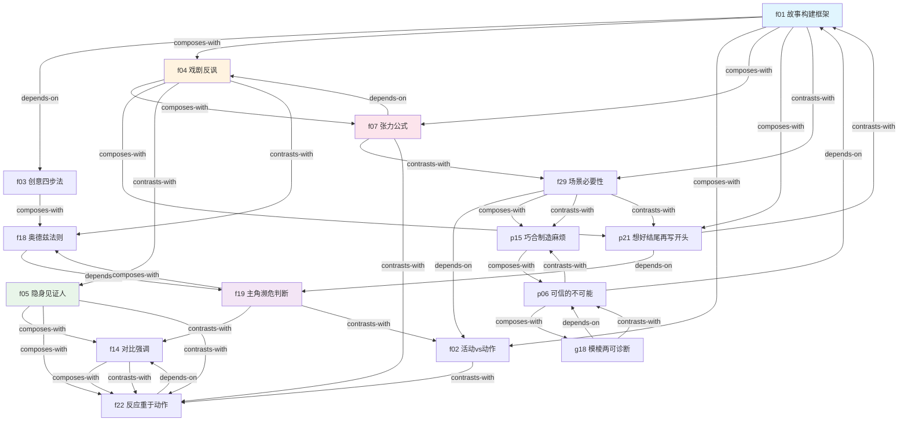

# 电影导演大师课 — Skill 总览

> 来源: 《电影导演大师课》 Alexander Mackendrick
> 蒸馏时间: 2026-06-07
> Skill 数量: 15

## Skill 清单

| ID | Skill | 类型 | 关键触发场景 |
|----|-------|------|-------------|
| f01 | directing-story-framework | framework | 从零构建故事结构、检查叙事完整性、"故事写到一半不知道怎么继续" |
| f02 | directing-activity-vs-action | diagnostic | 诊断场景/段落是否有戏剧价值、"这段有用吗"、"这个场景要不要删" |
| f03 | directing-idea-generation | process | 创意枯竭、"想不到点子"、"灵感枯竭"、创作瓶颈 |
| f04 | directing-dramatic-irony | technique | 制造张力、"观众知道但角色不知道"、"信息差"、希区柯克炸弹比喻 |
| f05 | directing-invisible-witness | technique | 摄影机决策、"该用什么景别"、"观众应该认同谁"、镜头角度选择 |
| f07 | directing-tension-formula | diagnostic | 场景缺乏吸引力、"张力断了"、"中段塌了"、观众走神 |
| f14 | directing-contrast-emphasis | principle | 注意力引导、"重点不够突出"、"什么都想放上去"、做减法而非加法 |
| f18 | directing-odets-rewrite | technique | 对手戏/交锋场景平淡、"对话不像在交锋"、信息平铺直叙 |
| f19 | directing-protagonist-endangered | diagnostic | 多角色无法确定主角、"主角不像主角"、冲突不够强烈 |
| f22 | directing-reaction-over-action | principle | 增强情感冲击力、"观众没有被打动"、"该切到谁" |
| f29 | directing-scene-necessity | diagnostic | 判断场景是否该保留、"这段要不要删"、"结构拖沓" |
| p06 | directing-credible-impossible | principle | 评估虚构设定可信度、"这个设定合理吗"、"观众会信吗" |
| p15 | directing-coincidence-trouble | principle | 判断巧合使用是否合理、"天降神兵"、"deus ex machina" |
| p21 | directing-end-before-begin | principle | 没确定终点就开始动笔、"不知道从哪里开始"、"结局总觉得不对" |
| g18 | directing-ambiguity-diagnosis | diagnostic | 判断"模糊"是深度还是混乱、"这里是不是太模糊了"、"开放式结局行不行" |

## 引用图

## 主题聚类

### 叙事构建 (Narrative Construction)
从零开始构建故事或逆向设计故事结构的方法论集合。
- **f01** 故事构建框架 — 正向逐步构建
- **f03** 创意四步法 — 故事构建的上游：先有创意
- **f07** 张力公式 — 构建过程中每个步骤的底层动力
- **p06** 可信的不可能 — 构建世界观的可信度标准
- **p21** 想好结尾再写开头 — 逆向设计原则
- **g18** 模棱两可诊断 — 构建深度的多义性检验

### 导演视角 (Director's Perspective)
拍摄和剪辑层面的视觉叙事决策工具。
- **f05** 隐身见证人 — 核心决策工具：观众通过谁的眼睛看
- **f14** 对比强调 — 见证人框架的底层原理
- **f22** 反应重于动作 — 剪辑内容选择原则
- **f04** 戏剧反讽 — 信息管理操控观众心理

### 编剧实操 (Screenwriting Practice)
场景级别的诊断和增强工具。
- **f02** 活动vs动作 — 单场景元素的微观诊断
- **f18** 奥德兹法则 — 交锋场景的结构增强
- **f19** 主角濒危判断 — 角色层面的冲突强度诊断
- **f29** 场景必要性 — 场景在因果链中的位置诊断
- **p15** 巧合制造麻烦 — 场景中巧合元素的因果方向检验

## 引用关系统计

| 关系类型 | 数量 |
|---------|------|
| depends-on | 8 |
| composes-with | 14 |
| contrasts-with | 15 |
| **总计** | **37** |

### 每个 skill 的连接度

| Skill | depends-on | composes-with | contrasts-with | 总计 |
|-------|-----------|---------------|----------------|------|
| f01 故事构建框架 | 1 (f03) | 4 (f04,f02,f07,p21) | 1 (f29) | 6 |
| f02 活动vs动作 | 0 | 2 (f01,f29) | 1 (f22) | 3 |
| f03 创意四步法 | 0 | 2 (f01,f18) | 1 (f01) | 3 |
| f04 戏剧反讽 | 0 | 3 (f01,f07,p21) | 2 (f05,f18) | 5 |
| f05 隐身见证人 | 0 | 3 (f14,f07,f22) | 2 (f04,f22) | 5 |
| f07 张力公式 | 1 (f04) | 2 (f01,f05) | 2 (f29,f22) | 5 |
| f14 对比强调 | 0 | 2 (f05,f22) | 2 (f22,f19) | 4 |
| f18 奥德兹法则 | 1 (f19) | 1 (f03) | 2 (f04,f07) | 4 |
| f19 主角濒危判断 | 1 (f07) | 2 (f18,p21) | 2 (f14,f02) | 5 |
| f22 反应重于动作 | 1 (f14) | 2 (f05,f14) | 4 (f07,f05,f02,f14) | 7 |
| f29 场景必要性 | 1 (f02) | 1 (p15) | 4 (f01,p21,f07,p15) | 6 |
| p06 可信的不可能 | 1 (f01) | 2 (g18,p15) | 2 (p15,g18) | 5 |
| p15 巧合制造麻烦 | 0 | 2 (p06,f29) | 2 (p06,f29) | 4 |
| p21 想好结尾再写开头 | 1 (f19) | 2 (f01,f04) | 2 (f01,f29) | 5 |
| g18 模棱两可诊断 | 1 (p06) | 1 (p06) | 1 (p06) | 3 |

## 全局拓扑

连接度最高的节点（hub）：
- **f22 反应重于动作** (7) — 剪辑原则的枢纽，连接导演视角和编剧实操
- **f01 故事构建框架** (6) — 叙事构建的核心，被最多 skill 引用
- **f29 场景必要性** (6) — 诊断工具的核心，与构建和增强都有交叉

关键依赖链：
- `f03 → f01 → f04 → f07`：从创意产生到故事构建到张力操控的主流程
- `f19 → f18`：从主角确认到场景增强的编剧流程
- `f01 → p21 → f19 → f07`：逆向设计 + 主角判断 + 张力检测的诊断回路
