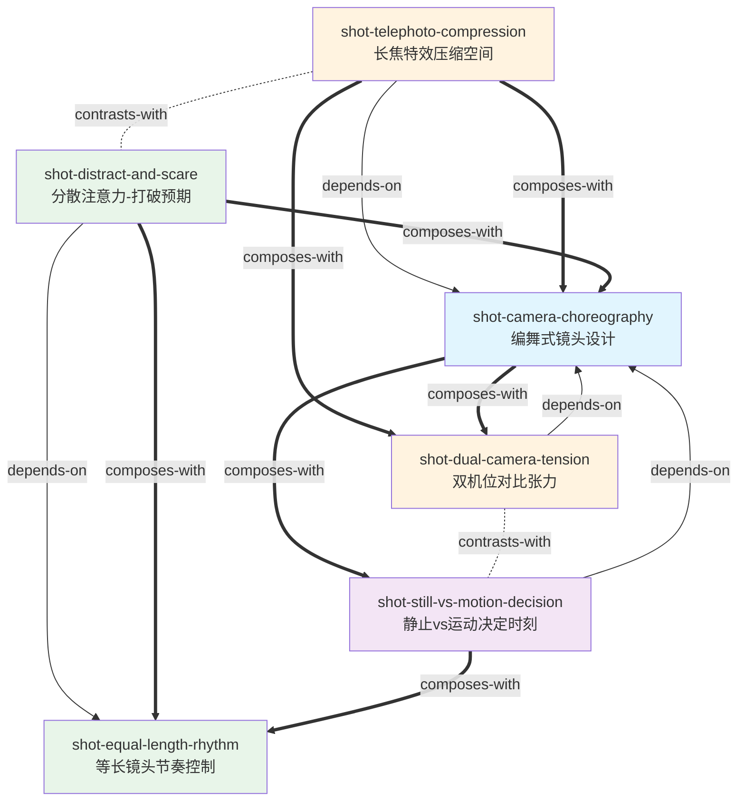

# 大师镜头 v1 — Skill 总览

> 来源: 《大师镜头：低成本拍大片的100个高级技巧（第1卷）》 Christopher Kenworthy
> 蒸馏时间: 2026-06-07
> Skill 数量: 6

## 关于这本书

- **作者**: Christopher Kenworthy
- **中文书名**: 大师镜头：低成本拍大片的100个高级技巧（第1卷）
- **一句话主旨**: 用编舞思维设计演员走位与摄影机运动的配合，以低成本镜头技法制造专业级视觉效果
- **整书理解**: 见 [BOOK_OVERVIEW.md](./BOOK_OVERVIEW.md)

---

## Skill 列表 (按主题分组)

### 元框架 (Meta-Framework)
全书100个技法的底层设计方法论——演员舞步+摄影机舞步的系统配合。

- [`shot-camera-choreography`](./shot-camera-choreography/SKILL.md) — 编舞式镜头设计：演员路线+摄影机路线的同步规划方法

### 空间操控 (Spatial Manipulation)
利用镜头焦距和多机位配置制造空间错觉、暗示力量对比。

- [`shot-telephoto-compression`](./shot-telephoto-compression/SKILL.md) — 长焦特效压缩空间：用长焦镜头的空间压缩制造视觉欺骗（借位打斗、追踪逼近）
- [`shot-dual-camera-tension`](./shot-dual-camera-tension/SKILL.md) — 双机位对比张力：两台摄影机的运动状态差异暗示力量对比（稳定=强势，慌乱=弱势）

### 时间操控 (Temporal Manipulation)
通过节奏控制和注意力管理制造惊吓、打破预期。

- [`shot-equal-length-rhythm`](./shot-equal-length-rhythm/SKILL.md) — 等长镜头节奏控制：等长镜头制造虚假安全感，打破等长释放张力
- [`shot-distract-and-scare`](./shot-distract-and-scare/SKILL.md) — 分散注意力-打破预期：三步惊吓策略（制造紧张→合理分散→突袭）

### 心理外化 (Psychological Externalization)
用静止与运动的对比外化角色的内心决定。

- [`shot-still-vs-motion-decision`](./shot-still-vs-motion-decision/SKILL.md) — 静止vs运动决定时刻：静止=蓄力挣扎，运动=释放决定

---

## 引用图



图例:
- `-->` depends-on (隐式: 元框架支撑具体技法)
- `==>` composes-with (可组合使用)
- `-.->` contrasts-with (对立/互补)

---

## 主题聚类

### 元框架 (Meta-Framework)
全书的底层设计方法论，其他所有技法都是它的特定应用。
- **shot-camera-choreography** 编舞式镜头设计 — 演员路线+摄影机路线的系统配合

### 空间操控 (Spatial Manipulation)
利用镜头焦距和机位配置制造空间层面的错觉和暗示。
- **shot-telephoto-compression** 长焦特效压缩空间 — 单机位的空间压缩错觉
- **shot-dual-camera-tension** 双机位对比张力 — 双机位的运动状态差异暗示力量对比

### 时间操控 (Temporal Manipulation)
通过节奏控制和注意力管理操控观众的时间感知。
- **shot-equal-length-rhythm** 等长镜头节奏控制 — 精确的节奏参数控制
- **shot-distract-and-scare** 分散注意力-打破预期 — 三步惊吓策略

### 心理外化 (Psychological Externalization)
用视觉手段外化角色的内心状态。
- **shot-still-vs-motion-decision** 静止vs运动决定时刻 — 动静对比外化心理决定

---

## 引用关系统计

| 关系类型 | 数量 |
|---------|------|
| depends-on (隐式) | 4 |
| composes-with | 7 |
| contrasts-with | 2 |
| **总计** | **13** |

### 每个 skill 的连接度

| Skill | depends-on | composes-with | contrasts-with | 总计 |
|-------|-----------|---------------|----------------|------|
| shot-camera-choreography | 0 | 3 (tele, still, dual) | 0 | 3 |
| shot-telephoto-compression | 1 (chore) | 2 (dual, chore) | 1 (scare) | 4 |
| shot-dual-camera-tension | 1 (chore) | 2 (tele, chore) | 1 (still) | 4 |
| shot-still-vs-motion-decision | 1 (chore) | 2 (chore, equal) | 1 (dual) | 4 |
| shot-equal-length-rhythm | 0 | 2 (scare, still) | 0 | 2 |
| shot-distract-and-scare | 1 (equal) | 2 (equal, chore) | 1 (tele) | 4 |

### 全局拓扑

连接度最高的节点（hub）：
- **shot-camera-choreography** (3) — 元框架，被3个技法隐式依赖，是全书的方法论基础
- **shot-telephoto-compression** / **shot-dual-camera-tension** / **shot-still-vs-motion-decision** / **shot-distract-and-scare** (各4) — 具体技法节点

关键组合链：
- `choreography → telephoto + dual-camera`：编舞法中组合长焦压缩和双机位对比，实现追踪场景的极致张力
- `equal-length + distract-and-scare`：等长镜头制造虚假安全感，分散注意力在此基础上完成三步惊吓
- `choreography → still-vs-motion + equal-length`：编舞法中动静决策配合节奏打破，外化角色心理决定

核心对比轴：
- **空间 vs 时间**: telephoto-compression（空间错觉）contrasts-with distract-and-scare（时间错觉）
- **单机 vs 双机**: still-vs-motion-decision（单摄影机状态切换）contrasts-with dual-camera-tension（双摄影机运动差异）

---

## 推荐学习顺序

（从元框架到具体技法，从空间到时间）

1. **shot-camera-choreography** — 元框架，所有技法的底层方法论，必须先掌握
2. **shot-telephoto-compression** — 空间操控基础，最直观的障眼法设计
3. **shot-still-vs-motion-decision** — 编舞法中的核心决策工具，理解动静对比
4. **shot-dual-camera-tension** — 双机位扩展，建立在编舞法和空间理解之上
5. **shot-equal-length-rhythm** — 时间操控基础，精确的节奏参数控制
6. **shot-distract-and-scare** — 综合应用，依赖等长镜头+编舞法的组合

---

## 接入 darwin-skill

所有 skill 均带有 `test-prompts.json` (darwin-skill 兼容格式), 可直接接入自动进化:

```
darwin evolve books/shot-design/
```

---

## 审计轨迹

- 候选单元池: [candidates/](./candidates/)
- 被淘汰的候选 (含原因): [rejected/](./rejected/)
- BOOK_OVERVIEW: [BOOK_OVERVIEW.md](./BOOK_OVERVIEW.md)
