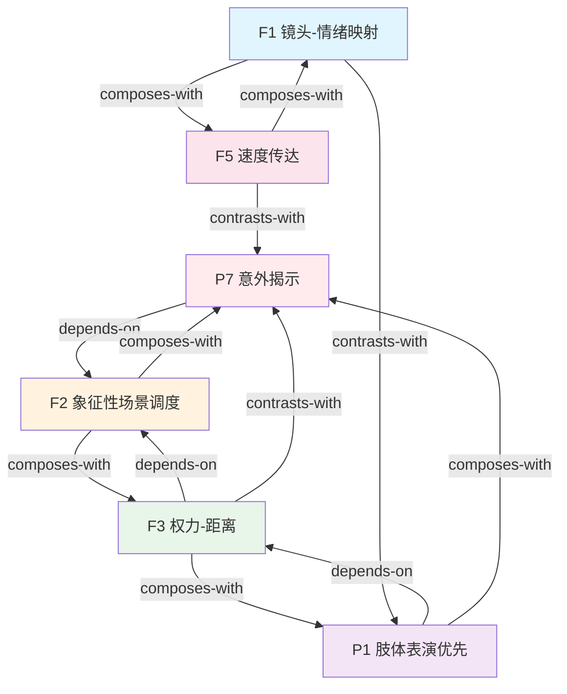

# 大师镜头 第三卷 — Skill 总览

> 来源: 《大师镜头 第三卷》 Christopher Kenworthy
> 蒸馏时间: 2026-06-07
> Skill 数量: 6

## Skill 清单

| ID | Skill | 类型 | 关键触发场景 |
|----|-------|------|-------------|
| F1 | msv3-lens-emotion-mapping | framework | 镜头选择、"该用什么焦段"、"这个场景什么感觉"、镜头-情绪匹配 |
| F2 | msv3-symbolic-staging | framework | 象征性叙事、"不用台词表达关系"、"潜文本"、镜头作为隐喻 |
| F3 | msv3-power-distance | framework | 权力动态、"谁控制场景"、"权力转移"、镜头-演员距离与权力 |
| F5 | msv3-speed-conveyance | framework | 追逐/动作场景、"感觉不够快"、"不想靠快剪"、速度感知 |
| P1 | msv3-body-performance | principle | 情感场景、"演员要求特写"、"表演不够好"、肢体语言优先 |
| P7 | msv3-unexpected-reveal | principle | 揭示信息、"打破观众预期"、"制造不安"、POV颠覆 |

## 引用图

## 主题聚类

### 镜头技术 (Camera Technique)
镜头选择和运动的基础技术框架。
- **F1** 镜头-情绪映射 — 焦段选择与情绪效果的系统映射
- **F5** 速度传达 — 不靠快剪传达速度的分层技术

### 象征性叙事 (Symbolic Narrative)
通过镜头位置和运动编码叙事意义。
- **F2** 象征性场景调度 — 镜头作为隐喻的词汇表
- **F3** 权力-距离 — 镜头-演员距离与权力感知的映射

### 表演与揭示 (Performance & Reveal)
镜头服务表演和观众心理的技术。
- **P1** 肢体表演优先 — 情感场景中肢体语言优先于面部特写
- **P7** 意外揭示 — 打破观众预期的镜头运动技术

## 引用关系统计

| 关系类型 | 数量 |
|---------|------|
| depends-on | 3 |
| composes-with | 6 |
| contrasts-with | 3 |
| **总计** | **12** |

### 每个 skill 的连接度

| Skill | depends-on | composes-with | contrasts-with | 总计 |
|-------|-----------|---------------|----------------|------|
| F1 镜头-情绪映射 | 0 | 2 (F5,speed) | 1 (P1) | 3 |
| F2 象征性场景调度 | 0 | 2 (F3,P7) | 0 | 2 |
| F3 权力-距离 | 1 (F2) | 2 (F2,P1) | 1 (P7) | 4 |
| F5 速度传达 | 0 | 1 (F1) | 1 (P7) | 2 |
| P1 肢体表演优先 | 1 (F3) | 1 (P7) | 1 (F1) | 3 |
| P7 意外揭示 | 1 (F2) | 1 (P1) | 1 (F3) | 3 |

## 全局拓扑

连接度最高的节点（hub）：
- **F3 权力-距离** (4) — 象征性叙事的核心应用，连接镜头技术与表演
- **F1 镜头-情绪映射** (3) — 镜头技术的基础，被速度传达引用
- **P1 肢体表演优先** (3) — 表演原则的枢纽，连接权力动态与揭示技术

关键依赖链：
- `F2 → F3 → P1`：从象征性叙事到权力动态到表演选择的主流程
- `F1 → F5`：从镜头-情绪映射到速度传达的技术链条
- `F2 → P7`：从象征性场景调度到意外揭示的叙事技巧链
