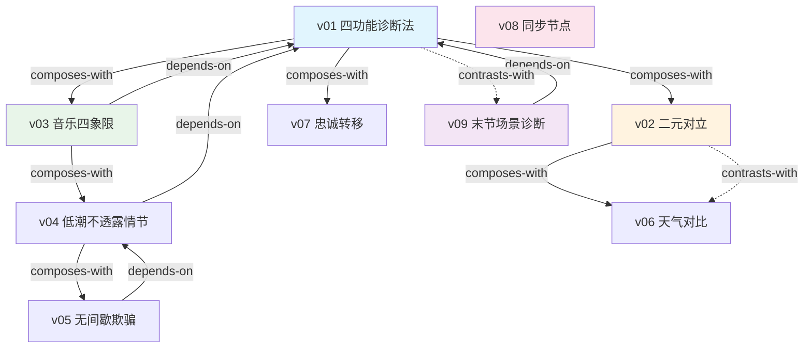

# 大师场景 — Skill Index

> 来源: 《大师场景：顶级场景转换术》 Jeffrey Michael Bays
> 蒸馏时间: 2026-06-07
> Skill 数量: 9

## Skill 清单

| ID | Skill | 类型 | 关键触发场景 |
|----|-------|------|-------------|
| v01 | scene-transition-four-function-diagnosis | framework | 场景转换目的不明确、"这个转换要达到什么效果" |
| v02 | scene-transition-binary-opposition | framework | 场景对比设计、"怎么让观众感受到变化" |
| v03 | scene-transition-music-quadrant | framework | 音频策略选择、"这里该用音乐还是静默" |
| v04 | scene-transition-low-point-no-plot | principle | 节奏过快需要喘息、"观众需要休息" |
| v05 | scene-transition-seamless-pause | principle | 长转换不拖沓、"怎么让观众不知道在休息" |
| v06 | scene-transition-weather-contrast | technique | 天气选择、"天气配合情绪太老套" |
| v07 | scene-transition-loyalty-transfer | technique | 角色认同转换、"怎么让观众喜欢新角色" |
| v08 | scene-transition-synch-node | framework | 多线叙事连接、"故事线怎么交汇" |
| v09 | scene-transition-caboose-diagnosis | diagnostic | 场景是否多余、"这个场景要不要删" |

## 引用图

## 主题聚类

### 诊断与决策 (Diagnosis)
- **v01** 四功能诊断法 — 确定转换目的的核心框架
- **v09** 末节场景诊断 — 反模式检测，删除多余场景

### 对比与并置 (Contrast)
- **v02** 二元对立 — 场景对比的通用工具
- **v06** 天气对比 — 对比的特殊应用（天气维度）

### 节奏与舒缓 (Rhythm)
- **v04** 低潮不透露情节 — 舒缓的操作方法
- **v05** 无间歇欺骗 — 舒缓的高级技巧（隐性间歇）

### 音频策略 (Audio)
- **v03** 音乐四象限 — 音频策略的决策矩阵

### 角色与多线 (Character)
- **v07** 忠诚转移 — 角色认同的场景转换操控
- **v08** 同步节点 — 多线叙事的连接工具

## 引用关系统计

| 关系类型 | 数量 |
|---------|------|
| depends-on | 4 |
| composes-with | 6 |
| contrasts-with | 2 |
| **总计** | **12** |

## 推荐学习顺序

1. **v01 四功能诊断法** — 最基础，所有其他 skill 的决策前提
2. **v02 二元对立** — 对比设计的通用工具
3. **v04 低潮不透露情节** — 节奏控制的基础
4. **v03 音乐四象限** — 音频策略
5. **v05 无间歇欺骗** — 低潮的高级应用
6. **v09 末节场景诊断** — 质量控制
7. **v06 天气对比** — 对比的特殊应用
8. **v07 忠诚转移** — 进阶角色操控
9. **v08 同步节点** — 多线叙事进阶

## 接入 darwin-skill

所有 skill 均带有 `test-prompts.json` (darwin-skill 兼容格式)，可直接接入自动进化。

## 审计轨迹

- 候选单元池: [candidates/](./candidates/)
- 被淘汰的候选: [rejected/](./rejected/)
- BOOK_OVERVIEW: [BOOK_OVERVIEW.md](./BOOK_OVERVIEW.md)
- 三重验证: [verified.md](./verified.md)
