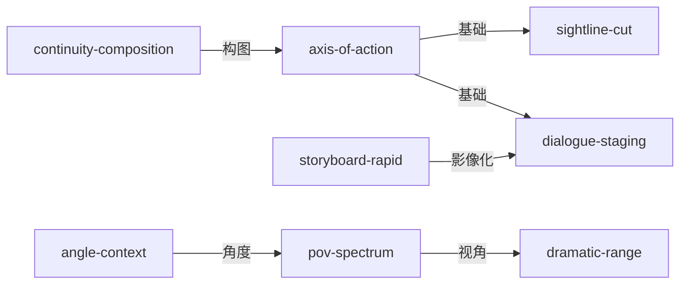

# 《电影镜头设计》Shot by Shot — Skill Index

> 本书由 book2skill 蒸馏, 共产出 **8** 个 skills。
> 处理时间: 2026-06-07
> 通过率: 21 候选 → 8 通过 (38%)

## 关于这本书

- **作者**: Steven D. Katz
- **出版年**: 1991
- **一句话主旨**: 从剧本到分镜的系统化视觉叙事方法——用镜头讲故事的完整工具箱
- **整书理解**: 见 [BOOK_OVERVIEW.md](./BOOK_OVERVIEW.md)

---

## Skill 列表 (按主题分组)

### 分镜与影像化

- [`shot-design-storyboard-rapid`](./shot-design-storyboard-rapid/SKILL.md) — 故事板快速影像化系统，用简笔人物和立方体快速表达镜头意图
- [`shot-design-angle-context`](./shot-design-angle-context/SKILL.md) — 摄影角度的上下文依赖性，打破"低角度=强势"的公式

### 空间与连续性

- [`shot-design-axis-of-action`](./shot-design-axis-of-action/SKILL.md) — 动作轴线与三角机位系统，180度规则的完整操作方法
- [`shot-design-sightline-cut`](./shot-design-sightline-cut/SKILL.md) — 视线剪切原则，建立空间连续性的基础工具
- [`shot-design-continuity-composition`](./shot-design-continuity-composition/SKILL.md) — 连续性构图原则，构图以连接关系而非单帧判断

### 调度与认同

- [`shot-design-dialogue-staging`](./shot-design-dialogue-staging/SKILL.md) — I/L/A形态对话调度系统，3种几何形态处理任意人数对话
- [`shot-design-pov-spectrum`](./shot-design-pov-spectrum/SKILL.md) — 视点认同度谱系，每个镜头都有主观性程度
- [`shot-design-dramatic-range`](./shot-design-dramatic-range/SKILL.md) — 戏剧动作范围三区间法，摄影机位置与观众认同的关系

---

## 引用图



---

## 推荐学习顺序

1. **shot-design-storyboard-rapid** — 最基础，快速影像化工具
2. **shot-design-axis-of-action** — 180度规则是空间连续性的核心
3. **shot-design-sightline-cut** — 视线剪切是空间建立的基础
4. **shot-design-continuity-composition** — 构图的连续性思维
5. **shot-design-dialogue-staging** — 对话场景的系统化调度
6. **shot-design-pov-spectrum** — 观众认同度的精细控制
7. **shot-design-dramatic-range** — 摄影机位置与戏剧张力
8. **shot-design-angle-context** — 角度选择的高级语境依赖

---

## 接入 darwin-skill

所有 skill 均带有 `test-prompts.json` (darwin-skill 兼容格式), 可直接接入自动进化:

```
darwin evolve books/shot-design/
```

---

## 审计轨迹

- 候选单元池: [candidates/](./candidates/)
- 被淘汰的候选 (含原因): [rejected/](./rejected/)
- BOOK_OVERVIEW: [BOOK_OVERVIEW.md](./BOOK_OVERVIEW.md)
