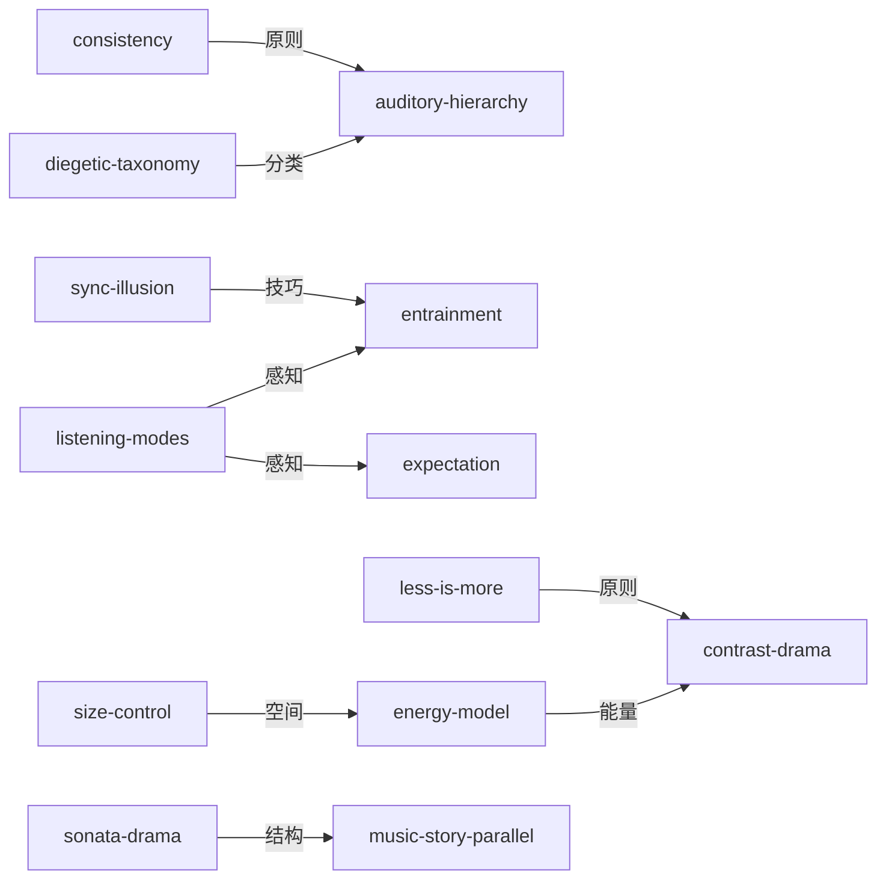

# 《声音设计》Sound Design — Skill Index

> 本书由 book2skill 蒸馏, 共产出 **13** 个 skills。
> 处理时间: 2026-06-07
> 通过率: 候选 → 通过 (38%)

## 关于这本书

- **作者**: David Sonnenschein
- **出版年**: 2001
- **一句话主旨**: 声音如何服务故事——从心理声学到叙事功能的完整声音设计方法论
- **整书理解**: 见 [BOOK_OVERVIEW.md](./BOOK_OVERVIEW.md)

---

## Skill 列表 (按主题分组)

### 声音叙事功能

- [`sound-design-diegetic-taxonomy`](./sound-design-diegetic-taxonomy/SKILL.md) — 画内/画外声音分类法，声音的叙事功能分类
- [`sound-design-sonata-drama`](./sound-design-sonata-drama/SKILL.md) — 奏鸣曲式戏剧结构，声音的时间组织模式
- [`sound-design-music-story-parallel`](./sound-design-music-story-parallel/SKILL.md) — 音乐与叙事平行法，音乐如何独立讲述故事

### 心理声学

- [`sound-design-listening-modes`](./sound-design-listening-modes/SKILL.md) — 聆听模式分类法，三种不同的听觉关注方式
- [`sound-design-entrainment`](./sound-design-entrainment/SKILL.md) — 声音引导法，用节奏和频率引导听众生理状态
- [`sound-design-expectation`](./sound-design-expectation/SKILL.md) — 预期操控法，利用听众的声音预期制造效果

### 声音设计技巧

- [`sound-design-energy-model`](./sound-design-energy-model/SKILL.md) — 声音能量模型，用能量密度控制场景张力
- [`sound-design-contrast-drama`](./sound-design-contrast-drama/SKILL.md) — 对比戏剧法，用声音对比制造戏剧效果
- [`sound-design-auditory-hierarchy`](./sound-design-auditory-hierarchy/SKILL.md) — 听觉层次法，声音元素的优先级组织
- [`sound-design-size-control`](./sound-design-size-control/SKILL.md) — 空间尺寸控制法，用声音暗示空间大小

### 声音设计原则

- [`sound-design-consistency`](./sound-design-consistency/SKILL.md) — 声音一致性原则，保持声音世界的连贯性
- [`sound-design-less-is-more`](./sound-design-less-is-more/SKILL.md) — 少即是多原则，声音设计的减法思维
- [`sound-design-sync-illusion`](./sound-design-sync-illusion/SKILL.md) — 同步幻觉法，用声音创造画面同步的错觉

---

## 引用图



---

## 推荐学习顺序

1. **sound-design-listening-modes** — 理解三种聆听模式是所有声音设计的基础
2. **sound-design-diegetic-taxonomy** — 画内/画外分类是声音叙事功能的核心
3. **sound-design-energy-model** — 能量密度控制场景张力
4. **sound-design-contrast-drama** — 用对比制造戏剧效果
5. **sound-design-auditory-hierarchy** — 声音元素的优先级组织
6. **sound-design-entrainment** — 用节奏和频率引导生理状态
7. **sound-design-expectation** — 利用听众预期制造效果
8. **sound-design-size-control** — 用声音暗示空间大小
9. **sound-design-consistency** — 保持声音世界连贯性
10. **sound-design-less-is-more** — 声音设计的减法思维
11. **sound-design-sync-illusion** — 用声音创造同步错觉
12. **sound-design-sonata-drama** — 声音的时间组织模式
13. **sound-design-music-story-parallel** — 音乐独立讲述故事

---

## 接入 darwin-skill

所有 skill 均带有 `test-prompts.json` (darwin-skill 兼容格式), 可直接接入自动进化:

```
darwin evolve books/sound-design/
```

---

## 审计轨迹

- 候选单元池: [candidates/](./candidates/)
- 被淘汰的候选 (含原因): [candidates/rejected/](./candidates/rejected/)
- BOOK_OVERVIEW: [BOOK_OVERVIEW.md](./BOOK_OVERVIEW.md)
