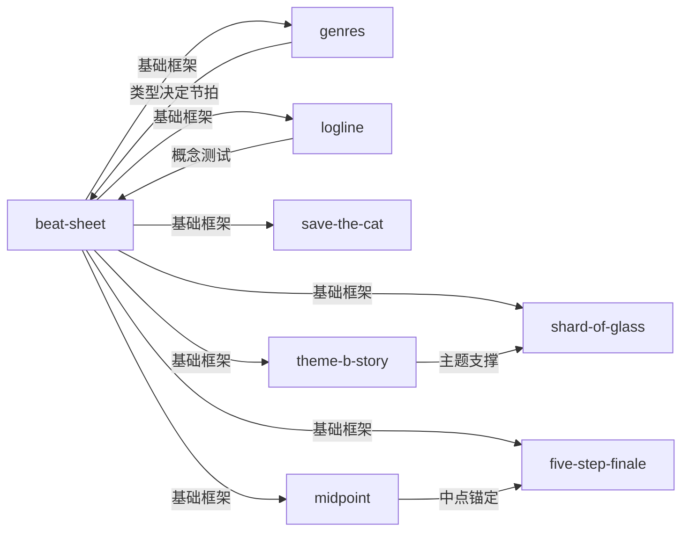

# 《救猫咪》Save the Cat! — Skill Index

> 本书由 book2skill 蒸馏, 共产出 **8** 个 skills。
> 处理时间: 2026-06-07
> 通过率: 72 候选 → 31 通过 (43%)

## 关于这本书

- **作者**: Blake Snyder
- **出版年**: 2005 (博客), 2016 (合集)
- **一句话主旨**: 商业化故事是可重复的结构化模板，15节拍+10种类型+具体技巧让任何故事都能被系统构建
- **整书理解**: 见 [BOOK_OVERVIEW.md](./BOOK_OVERVIEW.md)

---

## Skill 列表 (按主题分组)

### 核心框架

- [`story-design-beat-sheet`](./story-design-beat-sheet/SKILL.md) — BS2 十五节拍故事结构，从 Opening Image 到 Final Image 的完整骨架
- [`story-design-genres`](./story-design-genres/SKILL.md) — STC! 十种故事类型分类法，基于原始冲突的类型系统
- [`story-design-logline`](./story-design-logline/SKILL.md) — 4+4 Logline 公式，用 irony 测试概念可行性

### 角色与主题

- [`story-design-save-the-cat`](./story-design-save-the-cat/SKILL.md) — Save the Cat 认同建立法，4种变体让观众关心主角
- [`story-design-theme-b-story`](./story-design-theme-b-story/SKILL.md) — 主题通过 B Story 传达，不在 A Story 直接宣布
- [`story-design-shard-of-glass`](./story-design-shard-of-glass/SKILL.md) — 碎片隐喻，All Is Lost 的情感核心

### 结构操控

- [`story-design-midpoint`](./story-design-midpoint/SKILL.md) — Midpoint 假胜利/假失败，故事中点的转折操控
- [`story-design-five-step-finale`](./story-design-five-step-finale/SKILL.md) — 五步终局法，第三幕的结构化高潮设计

---

## 引用图



图例:
- `-->`  depends-on
- `-.->` contrasts-with
- `===>` composes-with

---

## 推荐学习顺序

1. **story-design-beat-sheet** — 最基础，15节拍是所有其他skill的骨架
2. **story-design-genres** — 类型决定节拍的具体内容
3. **story-design-logline** — 概念测试，在写剧本前就发现故事问题
4. **story-design-save-the-cat** — 角色认同，观众关心主角才能看下去
5. **story-design-theme-b-story** — 主题表达，故事'about'什么
6. **story-design-midpoint** — 中点锚定，防止第二幕塌陷
7. **story-design-shard-of-glass** — 情感深度，All Is Lost的灵魂
8. **story-design-five-step-finale** — 终局设计，第三幕的结构化工具

---

## 接入 darwin-skill

所有 skill 均带有 `test-prompts.json` (darwin-skill 兼容格式), 可直接接入自动进化:

```
darwin evolve books/story-design/
```

---

## 审计轨迹

- 候选单元池: [candidates/](./candidates/)
- 被淘汰的候选 (含原因): [rejected/](./rejected/)
- BOOK_OVERVIEW: [BOOK_OVERVIEW.md](./BOOK_OVERVIEW.md)
